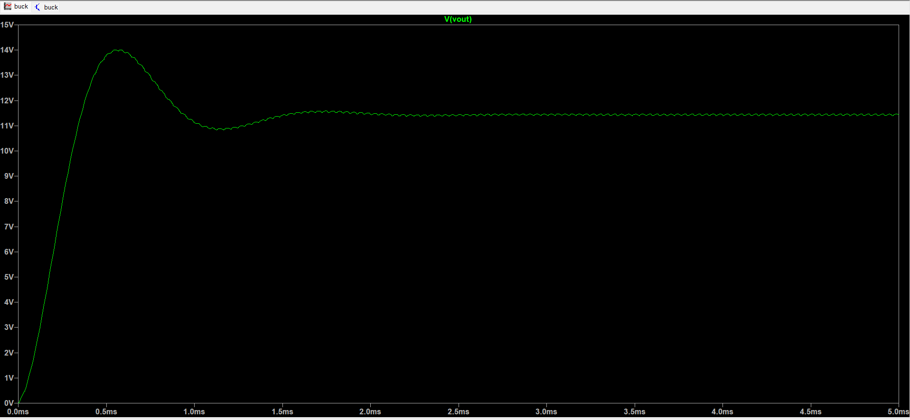
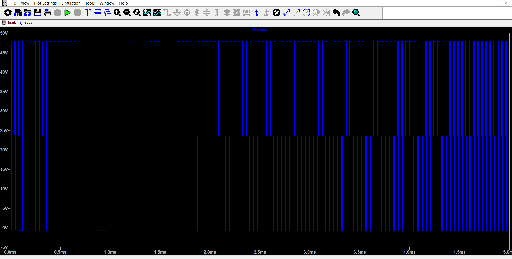
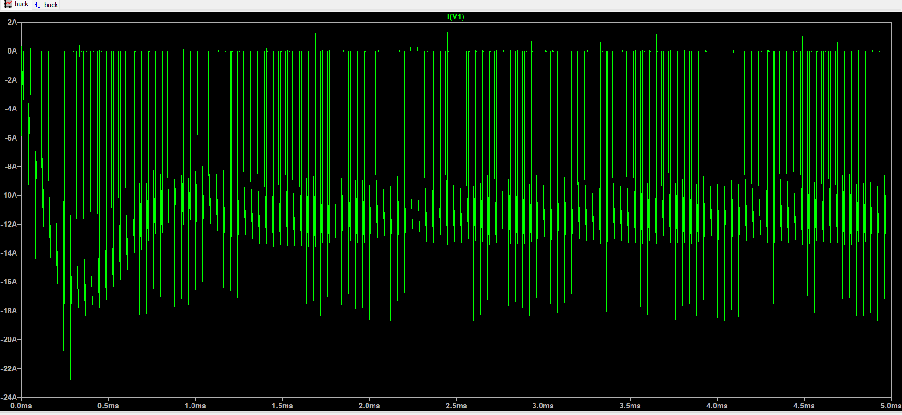
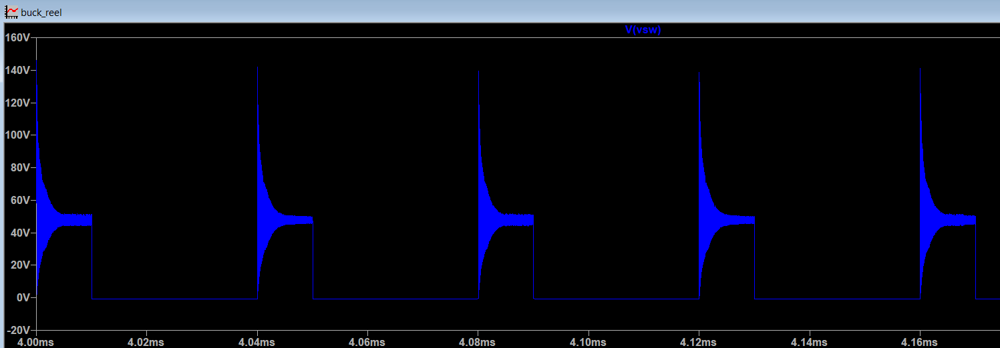
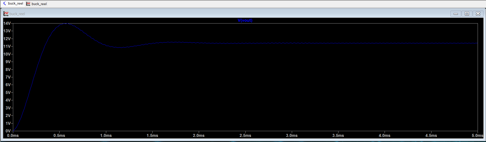
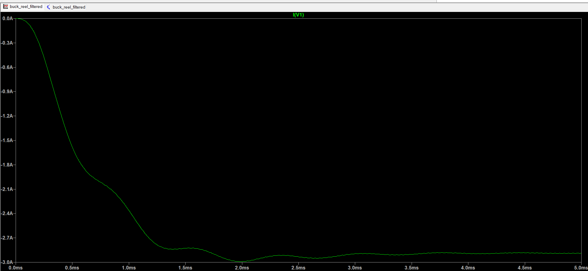
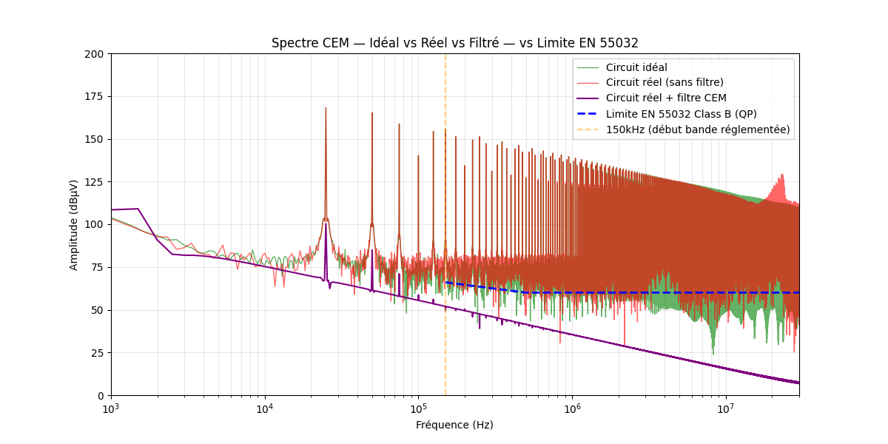

# Buck Converter - EMC Analysis & Filter Design
EMC analysis and filter design for a DC/DC buck converter with an LTspice simulation &amp; a Python FFT analysis. 

## Overview
Simulation and EMC compliance analysis of a DC/DC buck converter 
(48V → 12V, 100 kHz switching frequency).  
The project covers three phases:
- **Analysis** - identification of conducted EMI (electromagnetic interference) emissions via FFT
- **Design** - EMC filter dimensioning 
- **Validation** - comparison against EN 55022/32 Class B limits before and after filtering

All LTspice schematics (.asc) and Python analysis scripts (.py) are available in the `ltspice/` and `python/` folders of this repository.

## Industrial Context
Power electronics converters are widely used in embedded systems and many industries (aerospace, defense, industrial power conversion, automotive). 

Their switching behavior generates electromagnetic perturbations that must be controlled to ensure coexistence with sensitive onboard equipment (sonar, radar, communication systems) and compliance with international EMC standards 
(EN 55032, CISPR 25, MIL-STD-461, DO-160)..

## Tools
| Tool | Purpose |
|------|---------|
| LTspice XVII | Circuit simulation |
| Python | FFT analysis & filter design |
| NumPy | Signal processing |
| Matplotlib | Results visualization |

## Circuit parameters
| Component | Value | Role |
|-----------|-------|------|
| V1 | 48V DC | Input supply |
| M1 (AO6408) | NMOS | Main switch |
| D1 (MBR745) | Schottky | Freewheeling diode |
| L1 | 143 µH | Output inductor |
| C1 | 200 µF | Output capacitor |
| R1 | 1 Ω | Resistive load |
| Lp1, Lp2 | 10 nH | Parasitic inductances |
| Lf | 10 mH | EMC filter inductor |
| Cx | 10 µF | EMC filter capacitor |

## Roadmap
- [ ] Ideal buck converter simulation (LTspice)
- [ ] Real circuit with parasitic elements
- [ ] FFT analysis of input current (Python)
- [ ] EMC filter design and validation
- [ ] Final report

## Résultats

### Hacheur série idéal (48V → 12V, 100kHz, D=0.25)

La tension de sortie se stabilise autour de 12V après un dépassement transitoire d'environ 14V, ce qui est cohérent avec les prédictions théoriques.

La tension au nœud de commutation montre la forme d'onde carrée attendue, alternant entre 0V et 48V à la fréquence de découpage.

Le courant d'entrée présente la forme d'onde hachée caractéristique, qui sera analysée dans le domaine fréquentiel (FFT) dans la section suivante.

### 2. Circuit réel avec éléments parasites (Lp1 = Lp2 = 10nH)

L'ajout des inductances parasites de câblage fait apparaître des surtensions de ~140V au nœud de commutation (contre 48V pour le circuit idéal). Ces surtensions sont la source principale des 
perturbations CEM haute fréquence.

La tension de sortie reste stable à ~11.5V 
Les parasites n'affectent pas le fonctionnement du convertisseur mais polluent 
son environnement électromagnétique.

### 3. Circuit réel avec filtre CEM (Lf = 10mH, Cf = 10µF)

Le filtre LC de mode différentiel lisse complètement le courant d'entrée. Les perturbations haute fréquence ne remontent plus vers la source d'alimentation.

### 4. Analyse spectrale FFT - comparaison finale

Le spectre du courant d'entrée (converti en tension équivalente 
RSIL à 50Ω) montre clairement l'effet du filtre :
- **Rouge** : circuit réel sans filtre - dépassement de 90-100 dB 
  au-dessus de la limite normative
- **Violet** : circuit réel avec filtre - conforme ou quasi-conforme 
  sur toute la bande 150kHz-30MHz

*Note : la limite EN 55022/32 Class B (QP) est utilisée comme 
référence. La conversion courant → tension est effectuée via 
l'impédance standard du RSIL (50Ω).*

## Author
Christine Senghor - ENSEM Nancy, Electrical Engineering  

